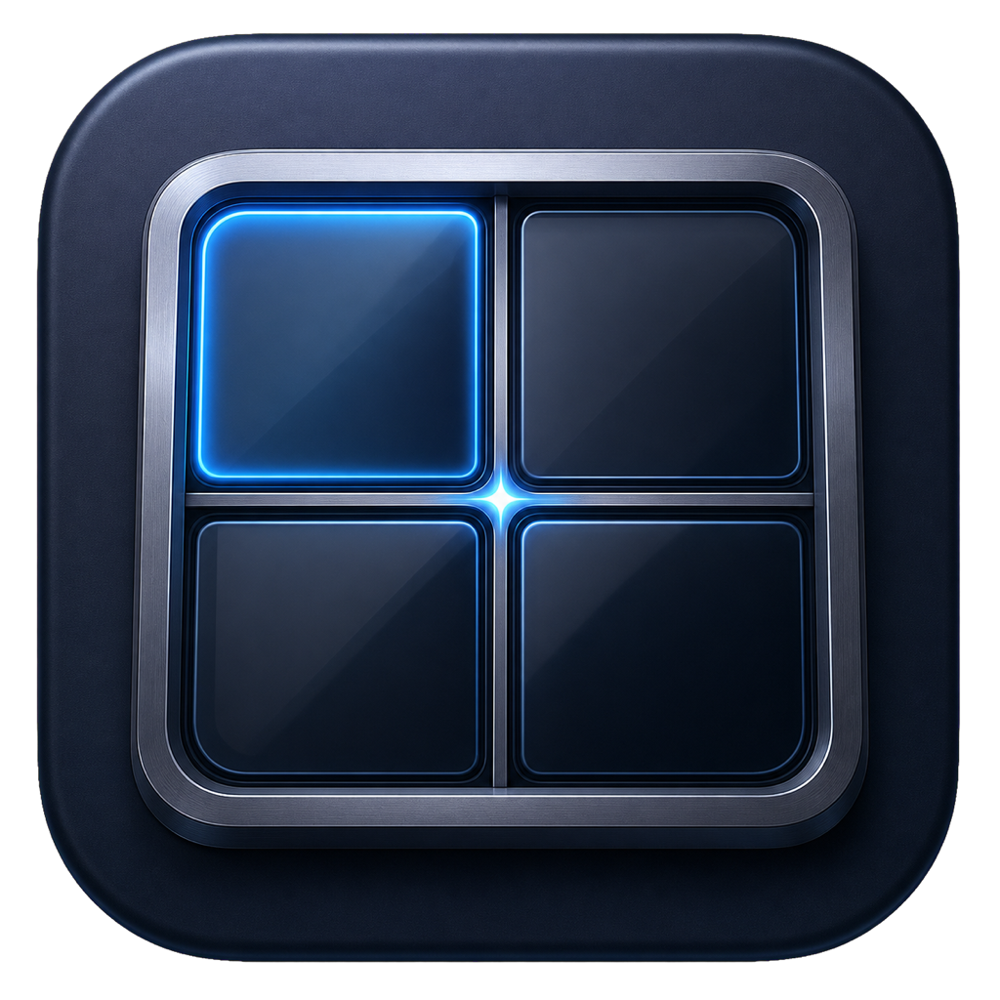
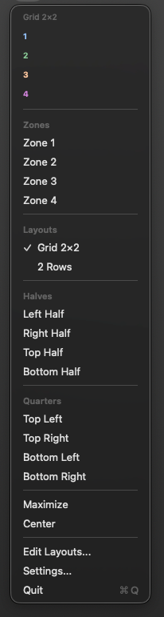
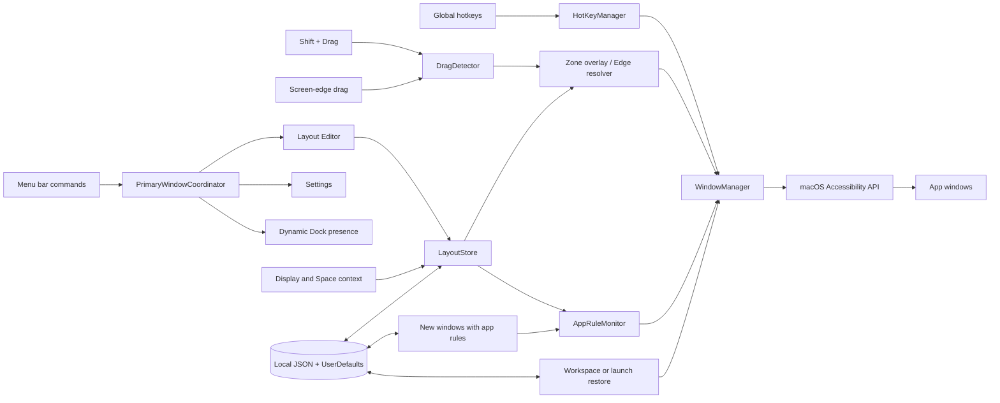

<p align="center">
  
</p>

<h1 align="center">EpycZones</h1>

<p align="center">
  Custom window layouts and fast snapping for macOS.
</p>

<p align="center">
  Native menu bar app · Shift + Drag · Edge snap · Multi-display
</p>

<p align="center">
  <a href="https://github.com/ulissescomonian/epyczones/releases/tag/v1.0"></a>
  
  
  
  <a href="https://github.com/ulissescomonian/epyczones/releases/tag/v1.0"></a>
  <a href="https://github.com/ulissescomonian/epyczones/actions/workflows/ci.yml"></a>
  <a href="LICENSE"></a>
</p>

<p align="center">
  <a href="https://github.com/ulissescomonian/epyczones/releases/download/v1.0/EpycZones-1.0-arm64.dmg"><strong>Download EpycZones 1.0 for Apple Silicon (.dmg)</strong></a>
  <br>
  <a href="https://github.com/ulissescomonian/epyczones/releases/tag/v1.0">Release notes and SHA-256 checksum</a>
</p>

> [!IMPORTANT]
> EpycZones 1.0 is a Preview. The Apple Silicon app has a local code signature,
> not an Apple Developer ID signature. Neither the app nor the DMG is notarized
> by Apple. Install it only from a source you trust, and never disable
> Gatekeeper to open it.

## What EpycZones does

EpycZones brings the custom window layouts of Windows PowerToys
[FancyZones](https://learn.microsoft.com/en-us/windows/powertoys/fancyzones)
to macOS. Create reusable zones, snap windows with the keyboard or a drag
gesture, and assign different layouts to each display or macOS Space.

It is a lightweight native menu bar app. EpycZones appears in the Dock while
the Layout Editor or Settings window is open or minimized, making it easy to
return to active work; it returns to menu-bar-only behavior after the last
window closes. There is no cloud service, account, telemetry, or third-party
Swift dependency.

## Highlights

- **30+ positioning geometries** — Halves, quarters, thirds, two-thirds,
  fourths, sixths, centered layouts, and more.
- **Shift + Drag zones** — Reveal the active layout, preview the destination,
  and span adjacent zones by dragging near their boundary.
- **Aero-style edge snap** — Drag to an edge or corner without a modifier and
  release after the configurable preview appears.
- **Visual layout editor** — Resize zones from eight handles, use a 24-division
  grid, or start from one of six templates.
- **Display- and Space-aware layouts** — Use a global layout or override it per
  monitor and per current macOS Space.
- **Keyboard-first workflow** — Rebind named actions and use fixed shortcuts
  for zones 1–9.
- **Width cycling and monitor flow** — Repeated left/right half shortcuts cycle
  through 1/2, 2/3, and 1/3 before moving to the adjacent display.
- **App rules** — Snap new standard windows from selected apps to a position or
  active-layout zone.
- **Workspaces and restore** — Save local window arrangements and restore
  previously snapped single-zone windows.
- **Native settings** — Launch at login, animation, overlay theme, zone gap,
  edge threshold, edge delay, hotkeys, rules, and workspaces.

## Screenshots

<table>
  <tr>
    <td align="center"><strong>Layout Editor</strong></td>
    <td align="center"><strong>Custom Hotkeys</strong></td>
    <td align="center"><strong>Menu Bar</strong></td>
  </tr>
  <tr>
    <td></td>
    <td></td>
    <td></td>
  </tr>
</table>

## Requirements

- macOS 14 Sonoma or later.
- Apple Silicon (`arm64`) for the distributed Preview DMG.
- Accessibility permission to inspect, move, and resize other applications'
  windows.
- Xcode or Xcode Command Line Tools with Swift 5.9 or later only when building
  from source.

The distributed DMG is not universal and does not run natively on Intel Macs.

## Install the Preview DMG

1. Download `EpycZones-1.0-arm64.dmg` and
   `EpycZones-1.0-arm64.dmg.sha256` from the same trusted
   [v1.0 Release](https://github.com/ulissescomonian/epyczones/releases/tag/v1.0).
2. Optionally verify the download in Terminal:

   ```bash
   cd ~/Downloads
   shasum -a 256 -c EpycZones-1.0-arm64.dmg.sha256
   ```

3. Open the DMG and drag **EpycZones.app** to **Applications**.
4. Eject the DMG.
5. In Finder, open **Applications**, Control-click EpycZones, choose **Open**,
   then confirm **Open**.

If macOS still blocks the first launch, open **System Settings → Privacy &
Security** and choose **Open Anyway** for EpycZones. The wording may vary by
macOS version. Do not disable Gatekeeper globally and do not remove quarantine
metadata as an installation shortcut.

### Accessibility permission

On first launch, EpycZones requests Accessibility access. Grant it under
**System Settings → Privacy & Security → Accessibility**, then reopen the app
if macOS asks you to do so. Without this permission, EpycZones cannot reliably
read, move, or resize windows from other applications.

### What the Preview signature means

The app has a local code signature so macOS can verify the internal integrity
of its bundle. It has no Apple Team ID, is not Developer ID signed, and is not
notarized. The DMG is also not signed or notarized. A local signer label in
`codesign` output is not an Apple trust assertion.

You can inspect an installed copy without modifying it:

```bash
codesign --verify --deep --strict /Applications/EpycZones.app
codesign -dv --verbose=4 /Applications/EpycZones.app
file /Applications/EpycZones.app/Contents/MacOS/EpycZones
```

## Using EpycZones

### Shift + Drag

Hold **Shift** while dragging a window. The active layout appears over the
display, with a ghost preview for the current destination. Release to snap or
press **Esc** to cancel. Drag near the boundary between adjacent zones to span
them; the destination is not persisted as a single-zone restore record.

### Edge snap

Drag a window near a display edge or corner without holding a modifier. After
the configured delay, EpycZones previews a half or quarter. Releasing snaps the
window; moving away or pressing **Esc** cancels it. The top edge can optionally
maximize instead of selecting the top half.

The default edge threshold is 30 points and the default delay is 0.2 seconds.
Both are configurable in Settings.

### Layouts, displays, and Spaces

Create a layout from scratch or from **2 Columns**, **3 Columns**, **2 Rows**,
**Grid 2×2**, **Priority Right**, or **Focus Center**. A fresh installation does
not create one automatically.

Layout selection follows this priority:

1. layout assigned to the current macOS Space;
2. layout assigned to the current display;
3. global active layout.

Display movement preserves the window's relative frame. Space-aware selection
chooses a layout for a Space; EpycZones does not move windows between Spaces.

### App rules and workspaces

An app rule applies to new standard windows from a selected application. Each
app can have one rule targeting a built-in position or zones 1–9 of the active
layout.

A workspace records the local bundle identifier, window title, display, and
relative frame of visible windows. Restoring a workspace moves matching windows
that are already open; it does not launch applications.

## Default keyboard shortcuts

Named actions use **⌃⌥** (Control + Option) by default and can be changed under
**Settings → Hotkeys**.

| Shortcut | Action |
|----------|--------|
| `⌃⌥ Num4` / `⌃⌥ Num6` | Left / right half, with repeated width cycling |
| `⌃⌥ Num8` / `⌃⌥ Num2` | Top / bottom half |
| `⌃⌥ U` / `⌃⌥ I` | Top-left / top-right quarter |
| `⌃⌥ J` / `⌃⌥ K` | Bottom-left / bottom-right quarter |
| `⌃⌥ D` / `⌃⌥ F` / `⌃⌥ G` | First / center / last third |
| `⌃⌥ E` / `⌃⌥ R` / `⌃⌥ T` | First / center / last two-thirds |
| `⌃⌥ Return` | Maximize |
| `⌃⌥ H` | Maximize height |
| `⌃⌥ Num5` | Center |
| `⌃⌥ -` / `⌃⌥ =` | Make smaller / larger |
| `⌃⌥ Delete` | Restore previous in-memory frame |
| `⌃⌥ Num7` / `⌃⌥ Num9` | Dock left / dock right |
| `⌃⌥ N` / `⌃⌥ P` | Next / previous display |
| `⌃⌥ L` | Cycle layout |
| `⌃⌥ 1` … `⌃⌥ 9` | Snap to active-layout zone 1 … 9 |

Zone shortcuts 1–9 are fixed. Named actions shown in the Hotkeys settings are
rebindable. Fourths, sixths, center half, and almost maximize begin without a
default binding when they are exposed as named actions.

## How It Works



| Component | Responsibility |
|-----------|----------------|
| `HotKeyManager` | Registers system-wide shortcuts with Carbon. |
| `DragDetector` | Observes local and global pointer events for zone and edge snapping. |
| `ZoneOverlayController` / `SnapPreviewController` | Present floating, non-activating zone and destination previews. |
| `LayoutStore` | Stores layouts and resolves Space, display, and global precedence. |
| `WindowManager` | Reads and applies window frames through the Accessibility API. |
| `AppRuleMonitor` | Watches selected applications for new standard windows. |
| `WorkspaceManager` / `WindowPersistence` | Save local arrangements and restore matching open windows. |
| `PrimaryWindowCoordinator` | Opens or focuses one Editor/Settings window and synchronizes dynamic Dock presence. |

Space-aware layout selection uses private Core Graphics Services APIs. This may
require maintenance after future macOS updates. There is no network or cloud
path in the application.

## Local data and privacy

EpycZones has no analytics, telemetry, account system, network client, or cloud
sync. Its state remains on the Mac in `UserDefaults` and JSON files under:

```text
~/Library/Application Support/EpycZones/
├── app-rules.json
├── layouts.json
├── window-zones.json
└── workspaces.json
```

Workspace and restore files can contain application bundle identifiers, display
names, and window titles. They are not encrypted. Treat them as local private
data and include them deliberately when making backups.

## Known limitations

- The current release is Apple Silicon only, locally signed, and not notarized.
- Space mapping depends on private macOS APIs and may change in a future macOS
  release. EpycZones does not move windows between Spaces.
- Workspace restore does not launch apps; matching windows must already exist.
- Some apps enforce minimum sizes, use non-standard windows, or refuse
  Accessibility frame changes.
- Undo/Restore is in memory and limited to recent frames; redo is not exposed.
- EpycZones has no automatic updater and currently has no automated Swift test
  target.

## Build and package from source

```bash
git clone https://github.com/ulissescomonian/EpycZones.git
cd EpycZones
make debug
make bundle
```

`make bundle` creates a local development bundle at `.build/EpycZones.app`.
It is useful for manual testing and may use an ad-hoc signature, so it is not a
release artifact and must not be distributed. To create a release DMG and
checksum, the release signing identity is required:

```bash
make dmg
```

The distributable files are written to `dist/`. Release packaging fails if the
stable `EpycZones Dev` identity is unavailable; it never substitutes an ad-hoc
signature. Packaging does not notarize the app or DMG.

## Project structure

```text
Sources/EpycZones/
├── EpycZonesApp.swift          # App entry point and menu bar UI
├── AppDelegate.swift           # Lifecycle and Accessibility setup
├── PrimaryWindowCoordinator.swift # Singleton windows and dynamic Dock presence
├── WindowManager.swift         # Accessibility window operations
├── DragDetector.swift          # Shift + Drag and edge detection
├── HotKeyManager.swift         # Carbon shortcut registration
├── LayoutStore.swift           # Layout persistence and precedence
├── LayoutEditorView.swift      # Visual editor
├── ZoneOverlayController.swift # Zone overlay and spanning preview
├── AppRuleMonitor.swift        # New-window rules
├── WorkspaceManager.swift      # Workspace capture and restore
└── SettingsView.swift          # Native settings interface

Resources/                      # App icon and Info.plist
screenshots/                    # README images
scripts/                        # Reproducible app and DMG packaging
```

See [CONTRIBUTING.md](CONTRIBUTING.md) for the development workflow and
[SECURITY.md](SECURITY.md) for vulnerability reporting and the Preview trust
model. Repository-specific agent instructions live only in
[AGENTS.md](AGENTS.md).

## Release notes

EpycZones 1.0 includes a premium macOS app icon for the Dock, Finder, DMG,
and README. The Layout Editor and Settings now share native singleton window
lifecycle management: repeated commands focus the existing window, minimized
windows are restored, and the Dock icon remains available until the last
primary window closes.

See the [EpycZones 1.0 Release](https://github.com/ulissescomonian/epyczones/releases/tag/v1.0)
for the current download, SHA-256 checksum, installation notes, and known
limitations.

## Acknowledgments

Inspired by [FancyZones](https://learn.microsoft.com/en-us/windows/powertoys/fancyzones)
from Microsoft PowerToys.

## License

[MIT License](LICENSE) — free to use, modify, and distribute.
